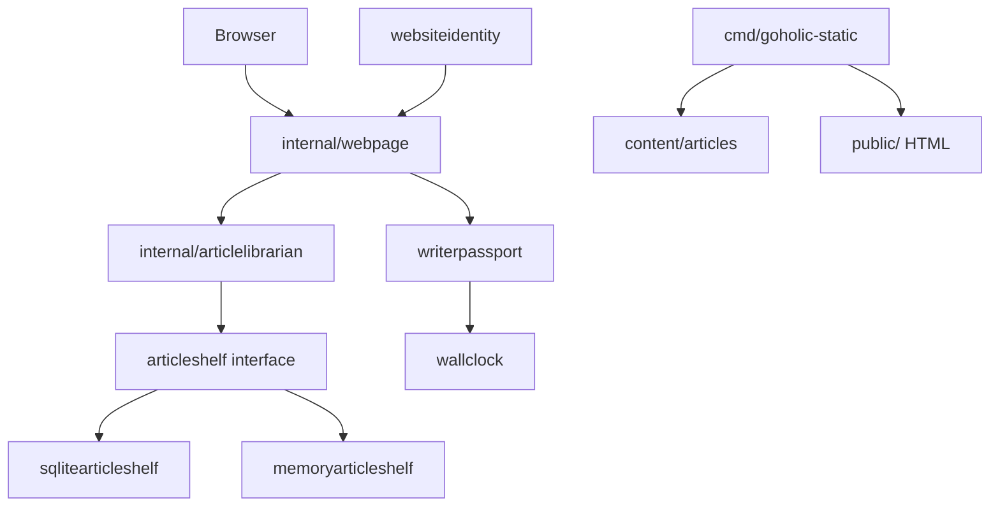

# Goholic

<div align="center">

**A small Go blog engine for [goholic.in](https://goholic.in). One binary, one sqlite file, HTML that speaks HTMX.**

[](https://go.dev/)
[](./LICENSE)
[](./.github/workflows/test.yml)

**golang · sqlite · htmx · blog-engine · cookies · markdown · static-export · vercel**

</div>

> **goholic** is the public notebook of Abir Sarkar, Software Engineer II (Go).
> Packages are named like rooms in a house so a stranger can guess the architecture from `ls internal`.

## Why this exists

I ship production Go services. The ones that last are the ones a tired teammate can open at midnight and still explain out loud. This site is that idea with the volume turned down.

Public pages are also **static-exported** to `public/` so [goholic.in](https://goholic.in) can sit on Vercel. The Go server remains the source of truth for local writing.

## Quick start

```bash
cd goholic
go test ./...

GOHOLIC_WRITER_USERNAME=abir \
GOHOLIC_WRITER_PASSWORD=change-me-now \
GOHOLIC_SESSION_SECRET=change-this-secret-use-32-bytes \
go run ./cmd/goholic-web-server
```

Open:

- http://127.0.0.1:8080 — landing page
- http://127.0.0.1:8080/article/from-kolkata-with-go — one story
- http://127.0.0.1:8080/writer/login — writer desk

An empty cabinet grows seed stories on first boot.

### Static site (Vercel)

```bash
go run ./cmd/goholic-static
# writes public/index.html and public/article/<slug>/index.html
```

Deploy the `public/` folder. Writer desk is not part of the static export.

## Installation

This is an application, not a library. Clone and run. Requires **Go 1.26.1**.

## Architecture



SOLID shows up as those rooms:

- **S**ingle job: a passport does not store stories
- **O**pen for new cabinets: add `postgresarticleshelf` later
- **L**iskov: memory and sqlite both keep `ArticleShelf`
- **I**nterface that is small: a clock only answers the time
- **D**epend on the promise: `webpage` never imports sqlite

Interactive map: [`docs/architecture.html`](docs/architecture.html)

## Project layout

```text
goholic/
├── cmd/goholic-web-server/   # process lifecycle, env, listen
├── cmd/goholic-static/       # markdown → public/ for Vercel
├── content/articles/         # published essays (source for static)
├── public/                   # generated static site
├── internal/article          # what a story is
├── internal/articleshelf     # the promise a cabinet must keep
├── internal/sqlitearticleshelf
├── internal/memoryarticleshelf
├── internal/articlelibrarian # draft, publish, hide, search
├── internal/writerpassport   # HMAC cookie for the writer desk
├── internal/webpage          # HTML + HTMX + markdown
├── internal/websiteidentity  # nameplate
├── ROADMAP.md
└── README.md
```

## Development

```bash
gofmt -w .
go test ./...
go test -race ./...
go run ./cmd/goholic-static
```

Markdown on purpose is small: headings, lists, `code`, and `**bold**`. Dangerous HTML is escaped.

## Roadmap

See [ROADMAP.md](./ROADMAP.md). Next production items: refuse compiled default passwords, move sqlite off the git tree, Postgres shelf, structured slog.

## Project status

Working personal blog engine. Static export is the public face. Writer desk is local.

## License

MIT

## Published site

`public/` is the live book site for [Defer Nothing](https://goholic.in/). Vercel serves that directory with no build step. Do not regenerate it with `go run ./cmd/goholic-static` and commit the result: that exporter still builds the old essay index and would replace the book.

Old essay URLs under `/article/` redirect to the book home.
